Data Descriptor

# A Comprehensive Dataset of the Aerodynamic and Geometric Coefficients of Airfoils in the Public Domain

Kanak Agarwal  $^{\dagger}$ $\mathbb{D}$ , Vedant Vijaykrishnan  $^{\dagger}$ $\mathbb{D}$ , Dyutit Mohanty  $^{\dagger}$ $\mathbb{D}$  and Manikandan Murugaiah * $\mathbb{D}$

Department of Aeronautical and Automobile Engineering, Manipal Institute of Technology, Manipal Academy of Higher Education, Manipal 576104, India

* Correspondence: manikandan.m@manipal.edu  
† These authors contributed equally to this work.

Abstract: This study presents an extensive collection of data on the aerodynamic behavior at a low Reynolds number and geometric coefficients for 2900 airfoils obtained through the class shape transformation (CST) method. By employing a verified OpenFOAM-based CFD simulation framework, lift and drag coefficients were determined at a Reynolds number of  $10^{5}$ . Considering the limited availability of data on low Reynolds number airfoils, this dataset is invaluable for a wide range of applications, including unmanned aerial vehicles (UAVs) and wind turbines. Additionally, the study offers a method for automating CFD simulations that could be applied to obtain aerodynamic coefficients at higher Reynolds numbers. The breadth of this dataset also supports the enhancement and creation of machine learning (ML) models, further advancing research into the aerodynamics of airfoils and lifting surfaces.

Dataset: https://github.com/kanakaero/Dataset-of-Aerodynamic-and-Geometric-Coefficients-of-Airfoils (accessed on 29 April 2024)

Dataset License: The dataset and the framework are available under the MIT License

Keywords: airfoil; computational fluid dynamics; OpenFOAM; class shape transformation; dataset; aerodynamic coefficients; geometric coefficients; aerodynamics; machine learning

Citation: Agarwal, K.; Vijaykrishnan,

V.; Mohanty, D.; Murugaiah, M. A

Comprehensive Dataset of the

Aerodynamic and Geometric

Coefficients of Airfoils in the Public

Domain.Data 2024,9,64.https://

doi.org/10.3390/data9050064

Academic Editor: Rüdiger Pryss

Received: 8 March 2024

Revised: 5 April 2024

Accepted: 27 April 2024

Published: 30 April 2024

Copyright: © 2024 by the authors. Licensee MDPI, Basel, Switzerland. This article is an open access article distributed under the terms and conditions of the Creative Commons Attribution (CC BY) license (https://creativecommons.org/licenses/by/4.0/).

# 1. Introduction and Background

Airfoils designed for low Reynolds numbers play crucial roles in various applications, such as in Unmanned Aerial Vehicles (UAVs), which are instrumental in executing high-definition remote sensing [1-6], infrastructure surveillance [7-9], 3D mapping [10-13] and photogrammetry tasks [14-19]. Additionally, they are vital for Small-Scale Wind Turbines (SSWTs), contributing to the reduction in electrical grid demands and greenhouse gas emissions [20-23]. To maximize the performance of these technologies, the airfoils must be specifically designed to meet their unique requirements. Techniques for optimizing airfoil design frequently include the use of genetic algorithms, surrogate modeling, and artificial neural networks [24-28].

This study enhances the development of machine learning approaches for airfoil optimization by generating a dataset with lift, drag, and parameterization coefficients for 2900 airfoils at a Reynolds number of  $10^{5}$ . A diverse dataset of airfoils was utilized during the course of this study. Airfoil profiles, including symmetric, asymmetric, cambered, and reflex profiles, were utilized to enhance the applicability of the framework developed. The lift and drag coefficients were generated using the Computational Fluid Dynamics (CFD) approach implemented in OpenFOAM v2306 [29]. It employs the Class Shape Transformation (CST) method [30] to describe the curve of each airfoil. Additionally, the CST method was applied to augment the point count in each airfoil's '.dat' file, improving the accuracy of the mesh. The dataset also incorporates these refined coordinates from

every '.dat' file. Finally, a baseline ML model is included to underscore the potential of our dataset.

# 2. Methodology

# 2.1. Airfoil Profile

The initial airfoil '.dat' files were obtained from the UIUC Airfoil Data Site [31] and the Airfoil Tools [32] online databases. These online repositories have a vast collection of diverse airfoil profiles ranging from the NACA 4, 5, and 6-digit airfoil series to the Eppler and the Selig series airfoils. These include symmetric, asymmetric, cambered, and reflex airfoils, which further enhance the scope of the framework developed. The '.dat' files were downloaded from the UIUC Airfoil Data Site using a Python script developed by Josh [33], and those from the Airfoil Tools site were downloaded manually. The '.dat' files thus obtained were of varying numbers of points, and hence, this was a major consideration during the automation of the Class Shape Transformation (CST) process. The study exclusively utilized '.dat' files in the Selig format. In this format, the coordinate system begins at  $(1,0)$ , advances to the leading edge, and then returns to  $(1,0)$  via the lower surface of the airfoil.

# 2.2. Class Shape Transformation (CST) Parametrization Technique

The CST (Class-Shape Transformation) or Kulfan airfoils constitute a group of airfoil profiles characterized by a parameterized representation of their upper and lower surfaces. The CST approach is a versatile parameterization strategy for crafting both two-dimensional and three-dimensional forms. Utilizing a class function alongside a shape function, the CST method encapsulates an airfoil's form, ensuring a closed trailing edge. Introduced by Kulfan [30], this parameterization technique delineates a two-dimensional figure through the integration of a class function  $C(\bar{x})$  and a shape function  $S(\bar{x})$ , augmented by a component that delineates the trailing edge's thickness.

The construction of an airfoil via the CST method involves aggregating the contributions from its foundational function, crafted using Bernstein polynomials. For initial airfoil design and optimization, CST employing lower-order polynomials is preferred due to its minimal parameter requirement for defining specific airfoil shapes. Although intricate, CST can be adapted to a wide array of aerodynamic body shapes without necessitating a predefined geometry. This methodology offers precise control over critical features such as the leading-edge radius, boat-tail angle, and trailing-edge thickness, making it applicable in both aerodynamic studies and optimization endeavors.

# 2.2.1. CST Formulation

The formulation for the Class Shape Transformation (CST) method elucidated in this section has been adapted from [30]. The general form of the mathematical expression that represents a typical airfoil geometry is as follows:

$$
\zeta (\psi) = \sqrt {\psi} (1 - \psi) \sum_ {i = 0} ^ {N} A _ {i} \psi^ {i} + \psi \zeta_ {T} \tag {1}
$$

where  $\psi = x / c$ ,  $\zeta = z / c$  and  $\zeta_{T} = \Delta Z_{TE} / c$ . The term  $\sqrt{\psi}$  corresponds to the round nose of the airfoil. Similarly, the term  $(1 - \psi)$  corresponds to the sharp trailing edge of the airfoil. The term  $\psi \zeta_{T}$  controls the thickness of the trailing edge, and the summation term is a general function that describes the shape of the airfoil between the round nose and the sharp trailing edge.

Figure 1 provides a visual representation of the CST parameters [34] given by Equation (1).

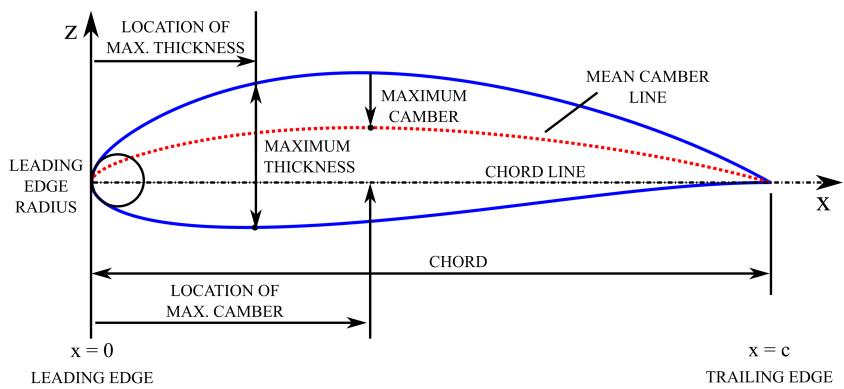  
Figure 1. CST parameters.

# 2.2.2. Airfoil Shape and Class Function

The shape function  $S(\psi)$  is given by the relation,

$$
S (\psi) = \sum_ {i = 0} ^ {N} \left[ A _ {i} \psi^ {i} \right] \tag {2}
$$

The term  $\psi [1 - \psi ]$  defines the class function  $C(\psi)$  given by,

$$
C _ {N 2} ^ {N 1} (\psi) \triangleq (\psi) ^ {N 1} [ 1 - \psi ] ^ {N 2} \tag {3}
$$

Typically, the parameters  $N1$  and  $N2$  are set to 0.5 and 1 for an airfoil with a rounded nose and a sharp trailing edge. The class function delineates broad categories of geometric forms, while the shape function specifies the exact contours within a particular geometric category.

Defining an airfoil shape function and specifying its geometry class is equivalent to defining the actual airfoil coordinates, which can then be obtained from the combination of the shape and class functions from the relation,

$$
\zeta (\psi) = C _ {N 2} ^ {N 1} (\psi) S (\psi) + \psi \zeta_ {T} \tag {4}
$$

The airfoil is then defined using the Bernstein polynomials, which are defined for the order  $n$  as follows,

$$
S _ {r, n} (x) = K _ {r, n} x ^ {r} (1 - x) ^ {n - r} \tag {5}
$$

The binomial coefficients are defined as,

$$
K _ {r, n} = \binom {n} {r} = \frac {n !}{r ! (n - r) !} \tag {6}
$$

The first term of the polynomial defines the leading-edge radius, and the last term is the boat-tail angle. The terms that fall in between serve as the "shaping terms". Here, a Bernstein polynomial of the eighth order is employed, resulting in eight weighted coefficients upon completion of the CST process. The upper surface of the airfoil is defined by the equations,

$$
\left(\zeta\right) _ {u p p e r} = C _ {N 2} ^ {N 1} (\psi) S l (\psi) + \psi \Delta \xi_ {u p p e r} \tag {7}
$$

$$
S u (\psi) = \sum_ {i = 1} ^ {N} A u _ {i} S _ {i} (\psi) \tag {8}
$$

The lower surface of the airfoil is defined by the equations,

$$
(\zeta) _ {l o w e r} = C _ {N 2} ^ {N 1} (\psi) S l (\psi) + \psi \Delta \xi_ {l o w e r} \tag {9}
$$

$$
S l (\psi) = \sum_ {i = 1} ^ {N} A l _ {i} S _ {i} (\psi) \tag {10}
$$

where,

$$
\Delta \xi_ {U} = \frac {z u _ {T E}}{C} \text {a n d} \Delta \xi_ {L} = \frac {z l _ {T E}}{C} \tag {11}
$$

The selection of an eighth-order Bernstein polynomial was justified by its drag predictions and pressure distribution, which perfectly matched experimental observations [30].

# 2.2.3. Key Observations

Throughout the process of airfoil parameterization, several key findings emerged that deserve attention. Notably, when the leading edge point deviated from the origin (0,0) with a y-offset, the airfoils generated through the CST method exhibited a marked increase in error percentage. This deviation significantly altered the airfoil's curvature, rendering it beyond the capture capability of the 'blockMesh' utility. Additionally, a significant portion of the airfoils had their trailing edges positioned away from (1,0), challenging the meshing process, which necessitates a trailing edge at (1,0). Consequently, airfoils not meeting this criterion were excluded from the preliminary airfoil database. The comparison between the original and the derived airfoils showed only a minimal error margin (less than  $5\%$  margin of error). This is elucidated in Figure 2. The original airfoil is given by the blue line, and the dashed line represents the airfoil profile generated using the CST framework. This approach was developed utilizing MATLAB® R2022b building on the work of Pramudita Satria Palar [35].

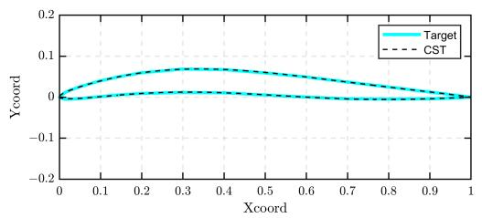  
(a) GOE 590 Airfoil

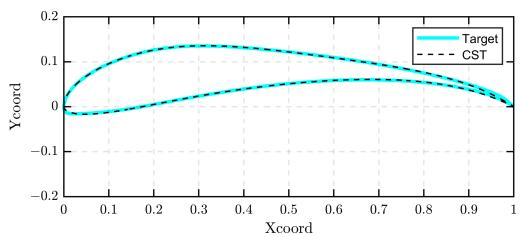  
(b) S1223 Airfoil

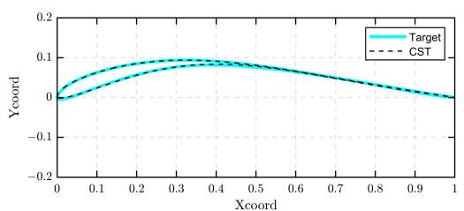  
(c) Eppler 377 Airfoil

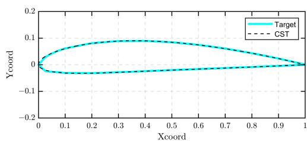  
(d) Clark K Airfoil  
Figure 2. Generation of airfoil sections using CST.

# 2.2.4. Shape Generation

Figure 2 illustrates several different airfoil sections created using the CST framework developed.

It is observed that the CST framework can capture diverse airfoil sections of varying thicknesses and curvatures accurately.

# 2.3. Geometry

The CST framework was used to create airfoils that were  $1\mathrm{m}$  in length. It generates the '.dat' file containing a specified number of points distributed evenly. Generating the '.dat' file with more points to increase the number of coordinates representing the airfoil surfaces

both enhances the smoothness of the airfoil geometry and leads to more precise simulations by better representing the airfoil's shape. Eventually, it was inferred that beyond 600 points, the number of airfoil coordinates in the '.dat' file no longer influenced the airfoil CFD lift/drag outcomes. Therefore, '.dat' files with 600 points were established as the standard for subsequent simulations.

The computational domain was designed with a C-type layout, maintaining an 11 chord length distance on average from the far field. The curved surface and both the top and bottom surfaces were assigned the role of flow inlet boundary, whereas the outlet condition was applied to the right-side wall. The domain is divided into seven blocks, as shown in Figure 3, with blocks 0, 1, and 2 serving as reflections of blocks 6, 5, and 4, respectively, across the chord line of the airfoil. The airfoil coordinates were interconnected using the OpenFOAM 'PolyLine' segments. However, as the 'Polyline' edges were not effectively capturing the airfoil's leading edge curvature, an additional block (block 3) was formed where the airfoil coordinates were connected through the OpenFOAM 'Spline' curve segments.

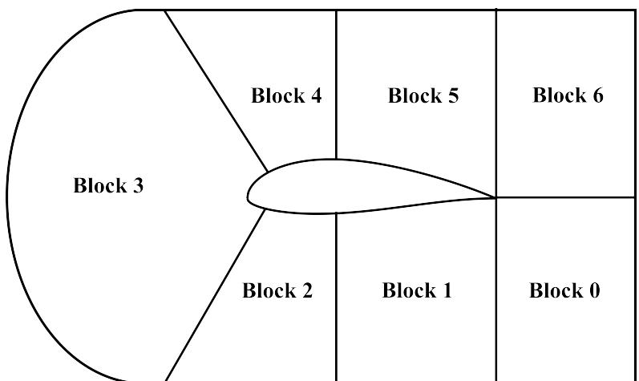  
Figure 3. Computational domain.

# 2.4. Mesh Setup and Details

This study utilized the OpenFOAM 'blockMesh' mesh generation utility. Initially, a study on mesh independence was conducted to assess the impact of the quantity and dimensions of mesh cells on the outcome of the simulation. It was observed that an increase in the number of cells typically enhances the accuracy of the simulation, albeit at the cost of increased computational time and resources. This study of grid independence involved a comparison of the lift coefficient for the symmetric NACA 0018 airfoil at a  $4^{\circ}$  angle of attack.

Figure 4 demonstrated that a grid with 198,000 cells is adequate for achieving a solution that is independent of grid size. This grid comprised 198,000 structured hexahedral cells, segmented into a far-field zone and a more detailed near-field region as shown in Figure 5.

Multi-grading techniques were employed to modulate the cell expansion ratios within the blocks and enhance the refinement of the boundary layer adjacent to the airfoil wall. Furthermore, the aspect ratio of cells near the airfoil was meticulously managed to ensure they remained within acceptable ranges, given that cells with high aspect ratios, particularly in areas sensitive to flow, can sometimes compromise the reliability of the findings.

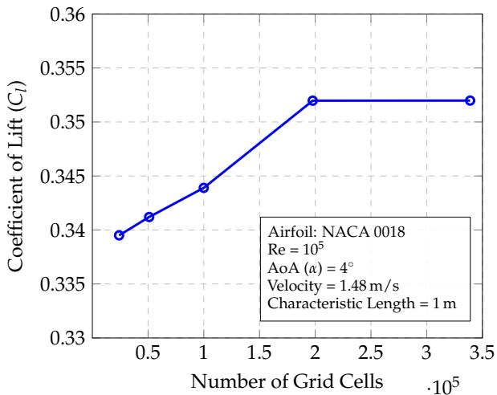  
Figure 4. Results of the grid independence study.

<table><tr><td>Number of Cells</td><td>Cl</td></tr><tr><td>24,000</td><td>0.33950</td></tr><tr><td>51,000</td><td>0.34120</td></tr><tr><td>100,000</td><td>0.34390</td></tr><tr><td>197,750</td><td>0.35197</td></tr><tr><td>339,000</td><td>0.35198</td></tr></table>

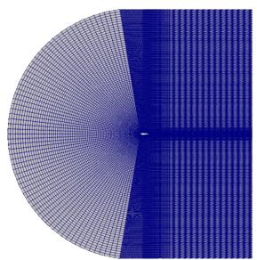  
(a) Mesh around NACA 0018 airfoil  
Figure 5. Mesh Domain

  
(b) Near-field Mesh Region

# 2.5. Solver Setup and Turbulence Model

The simulations were run using the steady-state Reynolds-Averaged Navier-Stokes (RANS) OpenFOAM 'simpleFOAM' solver along with the viscous Spalart-Allmaras turbulence model. SimpleFOAM is a pressure-based solver (for low-speed incompressible flows) that incorporates the SIMPLE (Semi-implicit Method for pressure-linked equations) algorithm. This solver is generally preferred to other pressure-based OpenFOAM solvers (such as PisoFoam or PimpleFoam) for largely incompressible and turbulent flows around airfoils.

The validity of numerical results greatly depends on the nature of the turbulence model utilized to predict real-world flow conditions. For flow over an airfoil, laminar flow eventually transitions to turbulent flow at the transition point (generally at  $30\%$  of the airfoil chord). However, during turbulence modeling, any of the selected turbulence models, which will have to capture the overall flow phenomena over the airfoil, will not account for the small laminar portion of the flow, and will rather assume fully turbulent flow, which can produce certain inherent biases in the generated data set, especially for the drag outcomes. Considering all of these, for the given flow conditions (incompressible, low-speed, low-Reynolds number) and the nature of simulations (external airfoil 2D flow), the Spalart-Allmaras (SA) single-equation model was deemed to be the most appropriate amongst the other turbulence models. In order to verify the fidelity of the results, apart from validation with published experimental data of other investigators, which the SA model had good agreement with over a wide range of angles of attack, parameters such as the  $y^{+}$  were considered. The  $y^{+}$  is a non-dimensional distance used to determine the proper size of the cells near domain walls during turbulence modeling. Given that the average  $y^{+}$  during most of our simulations was approximately 0.13, the Spalart-Allmaras model appears more than adequate for generating reliable high-fidelity data. The only limitation associated with the SA model is its inability to accurately predict drag outcomes in highly separated flow regions, such as at high angles of attack.

The Spalart-Allmaras model is a single-equation turbulence model, solving for the modified turbulent kinematic viscosity. It is widely used in various aerospace applications and is designed for low-velocity wall-bounding flows with boundary layers subject to adverse pressure gradients [36] like in airfoils. It is commonly used for low-Reynolds number flows and is more straightforward to implement, unlike other turbulence models such as the k-ε or the k-ω models, which require the turbulent length scale to be calculated. The Spalart-Allmaras transport equation [37], solving for the turbulent kinematic viscosity,  $\tilde{v}$ , is given below:

$$
\frac {\partial}{\partial t} (\rho \widetilde {v}) + \frac {\partial}{\partial x _ {i}} (\rho \widetilde {v} \mu_ {i}) = \frac {1}{\sigma_ {\widetilde {v}}} \left(\frac {\partial}{\partial x _ {j}} \left[ (\mu + \rho \widetilde {v}) \frac {\partial \widetilde {v}}{\partial x _ {j}} \right] + C _ {b 2} \rho \left(\frac {\partial \widetilde {v}}{\partial x _ {j}}\right) ^ {2}\right) + G _ {\widetilde {v}} - Y _ {\widetilde {v}} + S _ {\widetilde {v}} \tag {12}
$$

where  $\rho$  is the density,  $\nu$  is the molecular kinematic viscosity and  $\mu$  is the dynamic viscosity. The four terms on the right of Equation (12) represent the diffusion, transition, dissipation, and production terms, respectively. The turbulent viscosity,  $\mu_{t}$  can be determined through:

$$
\mu_ {t} = \rho \widetilde {v} f _ {v 1} \tag {13}
$$

Subsequently, the viscous damping function,  $f_{\nu 1}$  is given by:

$$
f _ {v 1} = \frac {X ^ {3}}{X ^ {3} + C _ {v 1} ^ {3}} \tag {14}
$$

X represents the ratio of the turbulent kinematic viscosity to the kinematic viscosity:

$$
X = \frac {\widetilde {v}}{v} \tag {15}
$$

The empirical constants for the Spalart-Allmaras model are given by:  $\sigma = 2/3$ ,  $\kappa = 0.41$ ,  $c_{b1} = 0.1355$ ,  $c_{b2} = 0.622$ ,  $c_{w1} = 3.239$ ,  $c_{w2} = 0.3$ ,  $c_{w3} = 2$ ,  $c_{v1} = 7.1$ ,  $c_{t3} = 1.2$ ,  $c_{t4} = 0.5$ .

The kinematic viscosity  $(\nu)$  for the domain is set to be  $1.48\times 10^{-5}\mathrm{m}^2 /\mathrm{s}$  which is the kinematic viscosity of air at  $15^{\circ}\mathrm{C}$ . For the Spalart-Allmaras model, the turbulent viscosity  $(\mu_t)$  is initialized to be equal to the kinematic viscosity in the internal field of the domain, while the turbulent kinematic viscosity  $(\tilde{v})$  is initialized to be equal to  $4\nu$ $(X = 4)$ .

# 2.6. Automation

Automating the dataset creation process was a key component of the research. This was achieved through a comprehensive strategy. The software tools utilized for automation, listed in the order of their application, are illustrated in Figure 6.

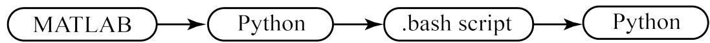  
Figure 6. Software used in the automation process.

The CST framework was constructed using MATLAB®. Python played a key role in the automation of mesh creation. The execution of CFD simulations was streamlined through the use of Bash scripts. Additionally, Python was employed for the analysis and postprocessing of the results of the CFD simulation. Figure 7 illustrates the step-by-step approach adopted to generate the dataset elucidated in the present work.

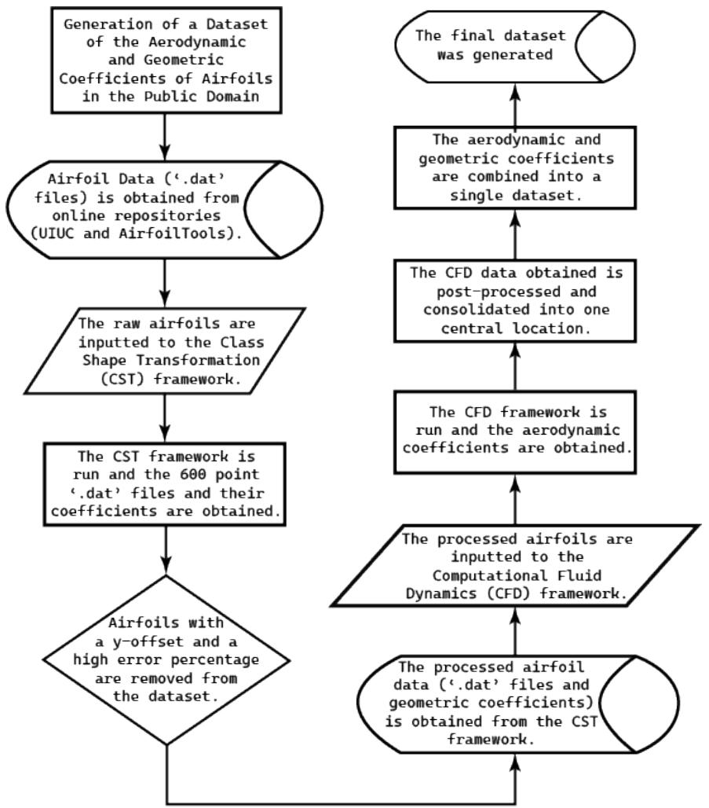  
Figure 7. Framework of automation approach.

# 2.6.1. Automation of CST Using MATLAB®

The automation of generating the CST coefficients and the creation of 600-point '.dat' files was facilitated through MATLAB®. The airfoil '.dat' file obtained from the online airfoil repositories was initially imported into MATLAB®. Following this, the Selig format '.dat' files were split into the coordinates of the upper and lower surfaces of the airfoil. The CST method using the shape and class functions was run individually on both the upper and lower surfaces. Thus, the CST coefficients of the airfoil were obtained. In order to increase the number of points in the '.dat' file to 600 points, the obtained coefficients were substituted in an eighth-order Bernstein polynomial. Regardless of the number of points in the initial '.dat' file, the CST framework generated the CST coefficients and a '.dat' file with 600 points. The number of points in the '.dat' file was standardized to be 600 (Section 2.3), which was crucial to the subsequent meshing process. This is elucidated visually in Figure 8.

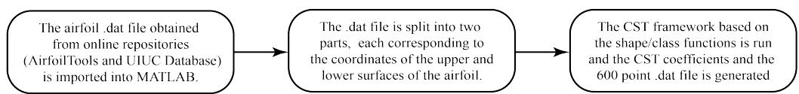  
Figure 8. CST automation using MATLAB®.

# 2.6.2. Mesh Generation

Initially, a BlockMeshDict file conforming to a standard was developed to streamline the meshing process for airfoils. Following this, a Python script was crafted to retrieve coordinates from a 600-point airfoil '.dat' file and methodically replace them line by line in

the specified lines of the BlockMeshDict file. This approach enabled the efficient meshing of any Selig format '.dat' file with 600 points.

# 2.7. Bash Scripting

Bash scripts were pivotal in the research process, being utilized across various phases of the simulation, from initiating the case setup to managing the postprocessing of the gathered results. Furthermore, they played a significant role in parallelizing the CFD simulations and controlling the numerous concurrent simulations.

# 2.7.1. CFD Automation

The convergence of CFD simulations is often determined by the property residuals, which represent the local imbalance of that conserved scalar within the control volume. In most CFD simulations, property residuals of the order of around  $10^{-5}$  are considered to be well converged, while residuals around  $10^{-6}$  are considered tightly converged (no further variation in the value of the property with further iterations). Tests across multiple airfoil shapes and angles of attack indicated that 2000 iterations consistently produced residuals of the order less than  $10^{-5}$  across all properties, including  $U_{x}$  (x-direction fluid velocity), P (local pressure) and the turbulence parameters. The  $U_{x}$  and  $U_{y}$  initial residuals plot for the simulation of NACA 0018 at  $0^{\circ}$  is shown in Figure 9. It can be inferred that beyond 1500 iterations, there is no substantial change in the residuals (almost a near-converged solution). Moreover, beyond 2000 iterations, the lift and drag coefficients only varied in the 4th and 6th decimal places, respectively, which have negligible contributions to the measured parameters. Furthermore, increasing the iteration count would significantly raise computational time and resources. Therefore, in the process of automating the simulations, the iteration limit for each airfoil was set to 2000.

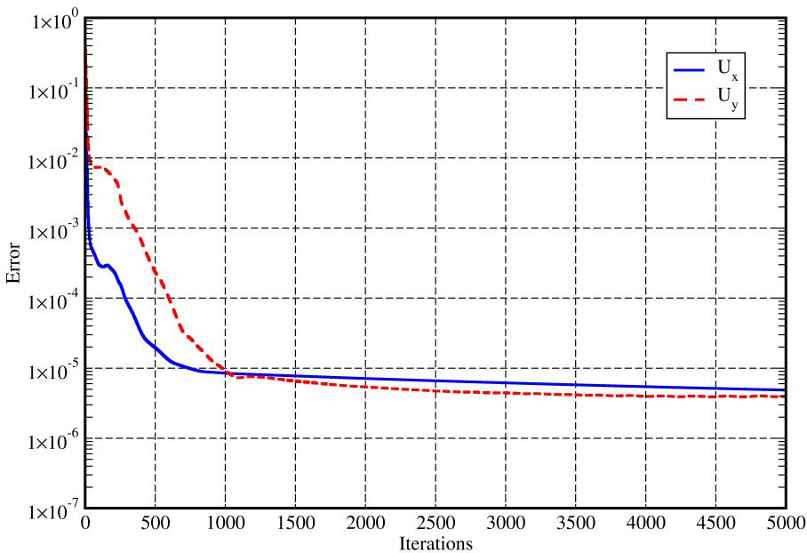  
Figure 9. Residuals plot for NACA 0018 at  $0^{\circ}$ .

# 2.7.2. Parallelization

Throughout the study, OpenFOAM v2306 was the designated software version in use. The primary tool for simulation, the simpleFOAM solver, is a CPU-based solver. Initial simulations were conducted on a laptop (on Ubuntu 23.10) equipped with a Ryzen 7 5800H CPU and 32 GB of RAM, featuring eight cores and 16 threads. Running a simulation on a single thread took about  $15\mathrm{min}$ , indicating that completing simulations for all the airfoils at a single angle of attack (AoA) would require approximately 31 days. This would translate into 403 days for 13 angles of attack. Due to the sheer amount of time it would take to

run simulations for 2900 airfoils at a single AoA, it was then decided to parallelize the simulation process.

Initially, parallel simulations were executed on the mentioned laptop before transferring the cases to a supercomputer powered by an AMD Epyc 32-core CPU with 110 GB of RAM. The airfoil database was divided into parts, allowing for simultaneous runs of one case per sub-database. This setup ensured that several simulations were operational concurrently. The optimal number of simultaneous simulations was determined through experimentation, considering both the supercomputer's performance and the cumulative simulation time for one AoA.

After fine-tuning the parallelization strategy, the ultimate simulations were carried out on four Intel Xeon Platinum Cascadelake 8268 processors, boasting a total of 96 cores and 1536 GB of RAM. The database was segmented into 96 parts, leading to a final simulation time of approximately two days for one AoA.

# 2.7.3. Post-Processing

A Python script was created to save the simulation outcomes ( $C_l$  and  $C_d$ ), the Angle of Attack (AoA), and the CST coefficients in a CSV (Comma Separated Values) file. The format of the CSV file is given in the following section. This approach was implemented to streamline the data consolidation process and facilitate subsequent data analysis.

# 3. Data Description

The dataset was stored on a GitHub repository. The data structure of the repository is shown in Figure 10. The repository is primarily divided into six parts. These correspond to the raw and processed airfoil data, the CFD and CST subdirectories, the final dataset, and the baseline model. The CFD subdirectory contains the OpenFOAM case setup and its associated directories. Similarly, the CST subdirectory contains the CST framework. Furthermore, separate directories have been created for the raw and processed airfoil databases. Additionally, the baseline model subdirectory was created for the baseline model developed for the current study.

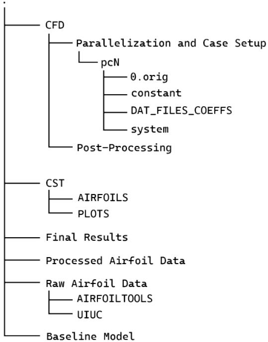  
Figure 10. The data structure of the GitHub Repository.

The outcome of this study, the final dataset, is provided in the following format represented in Table 1.

Table 1. Dataset format.  

<table><tr><td>Airfoil 
Filename</td><td>AoA (α)</td><td>X1</td><td>X2</td><td>X3</td><td>X4</td><td>X5</td><td>X6</td><td>X7</td><td>X8</td><td>C1</td><td>Cd</td></tr></table>

Here, AoA refers to the angle of attack,  $X_{i}$  the CST coefficients, and  $C_{l}, C_{d}$  are the lift and drag coefficients, respectively.

# 4. Data Validation

The validation of lift and drag coefficients for selected symmetric and cambered airfoils was achieved by comparing the simulation results with experimental data cited from two distinct sources, focusing on a Reynolds number approximating 100,000. This process aimed to affirm the precision of both the outcomes and the simulation methodology itself, involving a comparison across various airfoil types. However, due to space limitations, only a select number of relevant illustrations are included. The validation for NACA airfoils utilized findings from the NACA report [38], whereas validations for other non-NACA airfoils drew upon data from the data library [39].

The comparison includes numerically derived and experimentally measured lift and drag coefficients for a symmetric airfoil, specifically the NACA 0018 at a Reynolds number of 84,000, and a cambered airfoil, the NACA 2412, at a Reynolds number of 82,800. For each airfoil, these comparisons are depicted in the designated Figures 11 and 12.

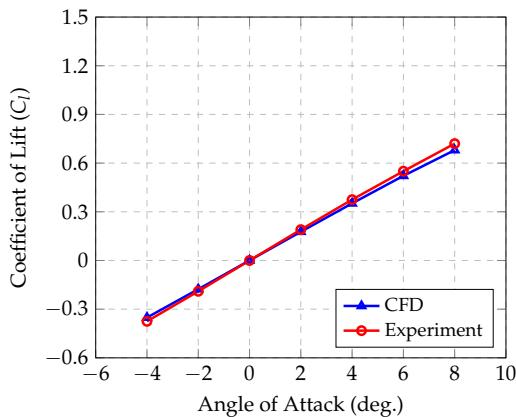  
(a) Lift Coefficient  $(C_l)$

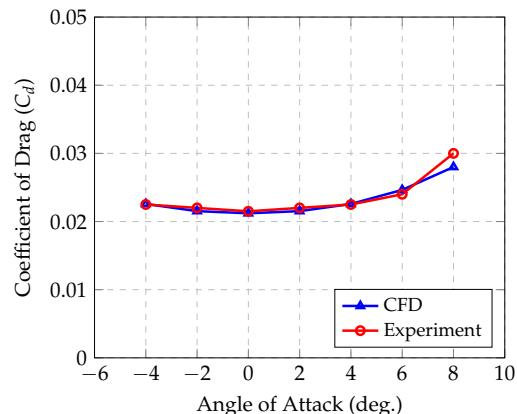  
(b) Drag Coefficient  $(C_d)$

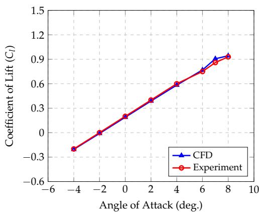  
Figure 11. Aerodynamic characteristics of NACA 0018 at  $\mathrm{Re} = 84,000$ .  
(a) Lift Coefficient  $(C_l)$  
Figure 12. Aerodynamic characteristics of NACA 2412 at  $\mathrm{Re} = 82,800$

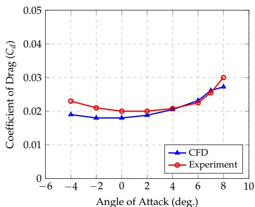  
(b) Drag Coefficient  $(C_d)$

The OpenFOAM model accurately predicts values within the selected range of angles of attack, paralleling experimental findings. The deviations for both lift and drag coefficients for the symmetric NACA 0018 airfoil fall below a  $5\%$  margin, indicating high precision

in the results. Similarly, lift coefficient estimates for the cambered NACA 2412 airfoil align closely with experimental data, remaining within a  $5\%$  error margin. However, the model tends to underestimate the drag coefficients for the NACA 2412, showing a discrepancy of about  $15\%$  at certain angles of attack. This pattern is consistent across other tested airfoils, where lift coefficients are accurately predicted while drag coefficients are slightly underestimated.

For the NACA 4415 and NACA 6412 airfoils at Reynolds numbers of 82,500 and 83,000, respectively, the results shown in Figures 13 and 14 showcase that while lift coefficient  $(C_l)$  values are within a  $5\%$  error margin, the gap between predicted and experimental drag coefficient  $(C_d)$  values widens beyond  $10\%$  at both high and notably negative angles of attack.

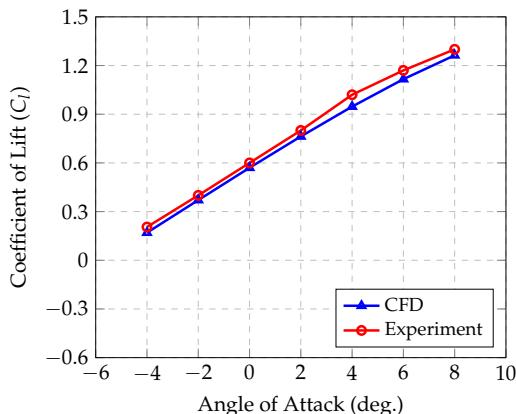  
(a) Lift Coefficient  $(C_l)$

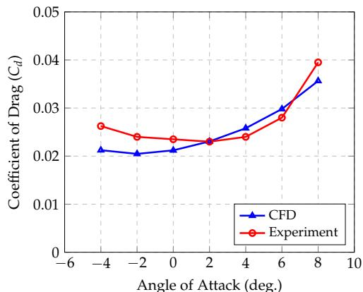  
(b) Drag Coefficient  $(C_d)$

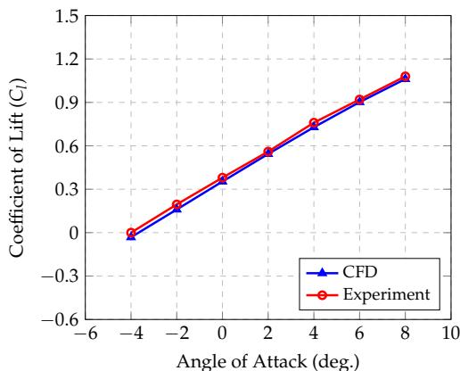  
Figure 13. Aerodynamic characteristics of NACA 4415 at  $\mathrm{Re} = 82,500$  
(a) Lift Coefficient  $(C_l)$  
Figure 14. Aerodynamic characteristics of NACA 6412 at  $\mathrm{Re} = 83,000$ .

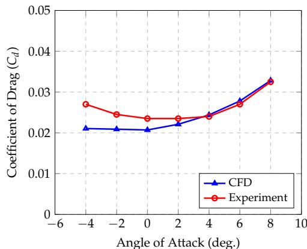  
(b) Drag Coefficient  $(C_d)$

Validation is also carried out for non-NACA airfoils. The results obtained for the Selig/Donnovan SD8020 airfoil at a Reynolds number of 101,800 is shown in Figure 15. The expected results are obtained; the error in the lift is less than  $4\%$  while the error in the drag coefficient remains less than  $10\%$  apart from at highly negative angles of attack.

One interesting inference that was derived from the validation study was that symmetric airfoil simulations produced more accurate drag results at higher angles of attack than cambered airfoils.

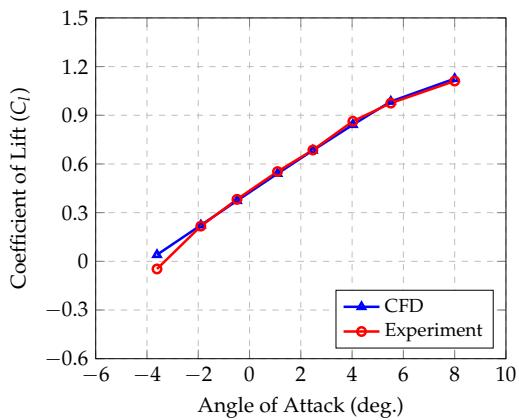  
(a) Lift Coefficient  $(C_l)$

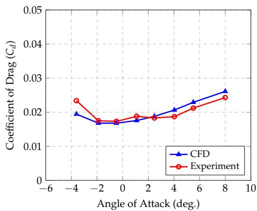  
(b) Drag Coefficient  $(C_d)$  
Figure 15. Aerodynamic characteristics of SD 8020 at  $\mathrm{Re} = 101,800$ .

Predicting the aerodynamic performance, particularly drag, in scenarios of high flow separation or at significant angles of attack poses a challenge for numerical methods [40]. As the angle of attack reaches its limits, leading to detached flows, simulation results tend to deviate from those reported in the literature. This deviation is challenging to address without resorting to unsteady Reynolds-Averaged Navier-Stokes (RANS) or Large Eddy Simulation (LES) techniques and the use of highly detailed meshes [41]. Previous studies, including this one, have noted inconsistencies in the numerical versus experimental lift  $(C_l)$  and drag  $(C_d)$  coefficients across angles of attack (AoA) when employing the Spalart-Allmaras model [42].

In any design process, CFD simulations are often conducted in the detailed final stages due to the amount of computational resources and time required to carry out the simulations. However, given that the dataset already consists of the required airfoil aerodynamic parameters, the data can be used in the initial stages of the design process. In the preliminary stages, the slight discrepancy in the drag coefficients at high angles of attack will not cause significant issues and will be more than adequate for initial estimates. This represents an alternative application for the generated dataset and serves as a much more comprehensive and accurate substitute instead of depending on crude panel solvers for initial estimates.

Furthermore, as highlighted in the introduction, at low-Reynolds numbers, the proposed dataset will find significant use while designing Unmanned Aerial Vehicles (UAVs). In order to remain within their limits of safe operation, these UAVs only fly at moderate Angles of attack, rarely exceeding  $7^{\circ} - 8^{\circ}$ , within which the aerodynamic predictions and results remain reasonably accurate. Moreover, beyond the selected range of angles of attack, extreme flow separation will initiate airfoil stalling characteristics. Given the diversity of airfoil shapes present in the dataset, the absolute stall angles will also vary considerably for each airfoil, and hence be extremely difficult to predict and standardize. This is another reason why a moderate angle of attack range (from  $-4^{\circ}$  to  $8^{\circ}$ ) was selected.

Overall, despite occasionally underestimating drag forces, the OpenFOAM numerical results provide adequate lift and drag estimations for the angles of attack required by our study, which do not involve predominant flow separation. Additionally, the high level of accuracy observed in simulations across various references [38,39] further confirms the feasibility and effectiveness of the automated simulation processes.

# 5. Baseline Machine Learning Model

To demonstrate the potential of our dataset in machine learning-based airfoil optimization approaches, we implemented a feed-forward neural network architecture. This network consists of two layers, with 12 and six neurons, respectively. Batch Normalization and ReLU activation functions were applied after each layer. The network was trained to

predict the lift and drag coefficients of an airfoil based on its eight CST coefficients and an angle of attack as input. The neural network's architecture is given in Figure 16.

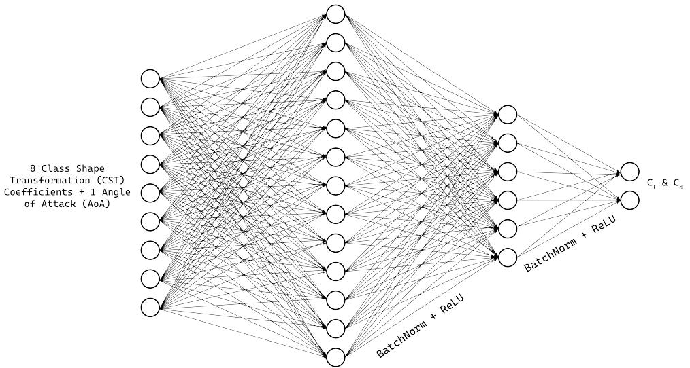  
Figure 16. Baseline neural network architecture.

To handle outliers and ensure robustness, we employed the Huber loss function, which dynamically adjusts between Mean Squared Error and Mean Absolute Error based on a threshold. The loss was minimized using the Adam [43] optimizer over 15 epochs, as depicted by the loss curve in Figure 17.

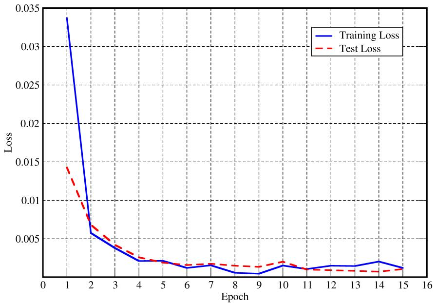  
Figure 17. Loss curve for baseline model training.

By coupling our model with a design optimizer, we streamline the airfoil optimization process, significantly reducing computational time compared to the conventional method of employing a design optimizer with a traditional CFD solver.

# 6. Conclusions

This paper introduces a dataset featuring airfoil aerodynamic coefficients and CST parameters of airfoils obtained from reputable online repositories (the UIUC Airfoil Database and Airfoil Tools). Focused on low Reynolds numbers (100,000), it serves as a proof of concept of a robust and automated framework for CFD analyses. The release of the CFD

framework and dataset sets the stage for future research, including the expansion to higher Reynolds numbers and the training of several AI models for low Reynolds number aerodynamic analyses. This is reinforced by the implementation of a baseline ML model using the generated dataset. This dataset could serve as a valuable resource for researchers and engineers in various fields.

Author Contributions: Conceptualization, M.M.; Methodology, M.M., V.V., K.A. and D.M.; Software, V.V., K.A. and D.M.; Validation, V.V.; Automation, K.A. and D.M.; Data Collection, K.A.; Writing—Original Draft Preparation, V.V., K.A. and D.M.; Writing—Review & Editing, V.V., K.A., D.M. and M.M.; Visualization, K.A.; Supervision, M.M. All authors have read and agreed to the published version of the manuscript.

Funding: This research received no external funding.

Institutional Review Board Statement: Not applicable.

Informed Consent Statement: Not applicable.

Data Availability Statement: The dataset, along with the framework used to generate the dataset, can be found on the GitHub repository (https://github.com/kanakaero/Dataset-of-Aerodynamic-and-Geometric-Coefficients-of-Airfoils accessed on 29 April 2024).

Acknowledgments: We would like to acknowledge the support of the Computer Science Engineering Department at the Manipal Institute of Technology, MAHE, Manipal, Karnataka, India. for giving us access to their supercomputer, "MIT Cloud GPU". We would also like to acknowledge the National Supercomputing Mission (NSM) for providing us with the computing resources of 'PARAM UTKARSH' at CDAC Knowledge Park, Bengaluru, Karnataka, India which is implemented by CDAC and supported by the Ministry of Electronics and Information Technology (MeitY) and the Department of Science and Technology (DST), Government of India. We also acknowledge the support of the Aeronautical and Automobile Engineering Department at the Manipal Institute of Technology, MAHE, Manipal, Karnataka, India, for all their support along the way. We authors would like to thank Noble Sharma, Senior Application Engineer, Engine Systems, Gamma Technologies, Pune, India, for extending his support in performing the CFD analysis in OpenFOAM.

Conflicts of Interest: The authors declare no conflicts of interest.

# References

1. Zhang, Z.; Zhu, L. A review on unmanned aerial vehicle remote sensing: Platforms, sensors, data processing methods, and applications. *Drones* 2023, 7, 398. [CrossRef]  
2. Lyu, X.; Li, X.; Dang, D.; Dou, H.; Wang, K.; Lou, A. Unmanned aerial vehicle (UAV) remote sensing in grassland ecosystem monitoring: A systematic review. Remote Sens. 2022, 14, 1096. [CrossRef]  
3. Yang, Z.; Yu, X.; Dedman, S.; Rosso, M.; Zhu, J.; Yang, J.; Xia, Y.; Tian, Y.; Zhang, G.; Wang, J. UAV remote sensing applications in marine monitoring: Knowledge visualization and review. Sci. Total Environ. 2022, 838, 155939. [CrossRef]  
4. Alexiou, S.; Efthimiou, N.; Karamesouti, M.; Papanikolaou, I.; Psomiadis, E.; Charizopoulos, N. Measuring annual sedimentation through high accuracy UAV-photogrammetry data and comparison with RUSLE and PESERA erosion models. Remote Sens. 2023, 15, 1339. [CrossRef]  
5. Joshi, A.; Pradhan, B.; Gite, S.; Chakraborty, S. Remote-sensing data and deep-learning techniques in crop mapping and yield prediction: A systematic review. Remote Sens. 2023, 15, 2014. [CrossRef]  
6. Xiang, T.Z.; Xia, G.S.; Zhang, L. Mini-unmanned aerial vehicle-based remote sensing: Techniques, applications, and prospects. IEEE Geosci. Remote Sens. Mag. 2019, 7, 29-63. [CrossRef]  
7. Lucic, M.C.; Bouhamed, O.; Ghazzai, H.; Khanfor, A.; Massoud, Y. Leveraging UAVs to enable dynamic and smart aerial infrastructure for ITS and smart cities: An overview. *Drones* 2023, 7, 79. [CrossRef]  
8. Outay, F.; Mengash, H.A.; Adnan, M. Applications of unmanned aerial vehicle (UAV) in road safety, traffic and highway infrastructure management: Recent advances and challenges. Transp. Res. Part Policy Pract. 2020, 141, 116-129. [CrossRef]  
9. Chelioti, K.H.; Tsaimou, C.N.; Tsoukala, V.K. Unmanned Aerial Vehicles: A Survey on Monitoring Advancements for Port Infrastructure Applications. J. Eng. Proj. Prod. Manag. 2023, 13. [CrossRef]  
10. Skondras, A.; Karachaliou, E.; Tavantzis, I.; Tokas, N.; Valari, E.; Skalidi, I.; Bouvet, G.A.; Stylianidis, E. UAV Mapping and 3D Modeling as a Tool for Promotion and Management of the Urban Space. *Drones* 2022, 6, 115. [CrossRef]  
11. Martinez Rocamora Jr, B.; Lima, R.R.; Samarakoon, K.; Rathjen, J.; Gross, J.N.; Pereira, G.A. Oxpecker: A tethered uav for inspection of stone-mine pillars. *Drones* 2023, 7, 73. [CrossRef]

12. Muhmad Kamarulzaman, A.M.; Wan Mohd Jaafar, W.S.; Mohd Said, M.N.; Saad, S.N.M.; Mohan, M. UAV Implementations in Urban Planning and Related Sectors of Rapidly Developing Nations: A Review and Future Perspectives for Malaysia. Remote Sens. 2023, 15, 2845. [CrossRef]  
13. Tagarakis, A.C.; Filippou, E.; Kalaitzidis, D.; Benos, L.; Busato, P.; Bochtis, D. Proposing UGV and UAV systems for 3D mapping of orchard environments. Sensors 2022, 22, 1571. [CrossRef] [PubMed]  
14. Chen, C.; Tian, B.; Wu, W.; Duan, Y.; Zhou, Y.; Zhang, C. UAV photogrammetry in intertidal mudflats: Accuracy, efficiency, and potential for integration with satellite imagery. Remote Sens. 2023, 15, 1814. [CrossRef]  
15. Fiz, J.I.; Martin, P.M.; Cuesta, R.; Subías, E.; Codina, D.; Cartes, A. Examples and results of aerial photogrammetry in archeology with UAV: Geometric documentation, high resolution multispectral analysis, models and 3D printing. *Drones* 2022, 6, 59. [CrossRef]  
16. Orsini, C.; Benozzi, E.; Williams, V.; Rossi, P.; Mancini, F. UAV photogrammetry and GIS interpretations of extended archaeological contexts: The case of tacuil in the Calchaúí area (Argentina). *Drones* 2022, 6, 31. [CrossRef]  
17. Kim, J.; Kim, I.; Ha, E.; Choi, B. UAV Photogrammetry for Soil Surface Deformation Detection in a Timber Harvesting Area, South Korea. Forests 2023, 14, 980. [CrossRef]  
18. Basyuni, M.; Wirasatriya, A.; Iryanthony, S.B.; Amelia, R.; Slamet, B.; Sulistiyono, N.; Pribadi, R.; Sumarga, E.; Eddy, S.; Al Mustaniroh, S.S.; et al. Aboveground biomass and carbon stock estimation using UAV photogrammetry in Indonesian mangroves and other competing land uses. *Ecol. Inform.* 2023, 77, 102227. [CrossRef]  
19. Yakar, M.; Ulvi, A.; Yiğit, A.Y.; Alptekin, A. Discontinuity set extraction from 3D point clouds obtained by UAV Photogrammetry in a rockfall site. Surv. Rev. 2023, 55, 416-428. [CrossRef]  
20. Alam, F.; Jin, Y. The Utilisation of Small Wind Turbines in Built-Up Areas: Prospects and Challenges. Wind 2023, 3, 418-438. [CrossRef]  
21. Aravindhan, N.; Natarajan, M.; Ponnuvel, S.; Devan, P. Recent developments and issues of small-scale wind turbines in urban residential buildings-A review. Energy Environ. 2023, 34, 1142-1169. [CrossRef]  
22. Oral, F. Use of small-scale wind turbines in road lighting. Light Eng. 2023, 31. [CrossRef]  
23. Greening, B.; Azapagic, A. Environmental impacts of micro-wind turbines and their potential to contribute to UK climate change targets. Energy 2013, 59, 454-466. [CrossRef]  
24. Li, J.; Zhang, M.; Tay, C.M.J.; Liu, N.; Cui, Y.; Chew, S.C.; Khoo, B.C. Low-Reynolds-number airfoil design optimization using deep-learning-based tailored airfoil modes. *Aerosp. Sci. Technol.* 2022, 121, 107309. [CrossRef]  
25. Du, X.; He, P.; Martins, J.R. Rapid airfoil design optimization via neural networks-based parameterization and surrogate modeling. *Aerosp. Sci. Technol.* **2021**, 113, 106701. [CrossRef]  
26. Bakar, A.; Li, K.; Liu, H.; Xu, Z.; Alessandrini, M.; Wen, D. Multi-objective optimization of low reynolds number airfoil using convolutional neural network and non-dominated sorting genetic algorithm. Aerospace 2022, 9, 35. [CrossRef]  
27. Chen, Z.; Wei, X.; Xiao, T.; Qin, N. Optimization of transonic low-Reynolds number airfoil based on genetic algorithm. Proc. Inst. Mech. Eng. Part J. Aerosp. Eng. 2024, 238, 44-60. [CrossRef]  
28. Ribeiro, A.; Awruch, A.; Gomes, H. An airfoil optimization technique for wind turbines. Appl. Math. Model. 2012, 36, 4898-4907. [CrossRef]  
29. Weller, H.G.; Tabor, G.; Jasak, H.; Fureby, C. A tensorial approach to computational continuum mechanics using object-oriented techniques. Comput. Phys. 1998, 12, 620-631. [CrossRef]  
30. Kulfan, B.M. Universal parametric geometry representation method. J. Aircr. 2008, 45, 142-158. [CrossRef]  
31. Selig, M. UIUC Airfoil Coordinates Database, Version 2.0, Contains Coordinates for Approximately 1600 Airfoils. Available online: https://m-selig.ae.illinois.edu/ads/coord_database.html. (accessed on 3 March 2024).  
32. Airfoil Tools. Available online: http://www.airfoiltools.com/index. (accessed on 3 March 2024).  
33. Josh. Available online: http://www.joshtheengineer.com/2019/01/30/uiuc-airfoil-database-file-download/. (accessed on 3 March 2024).  
34. Paula, A.A.d. The Airfoil Thickness Effects on Wavy Leading Edge Phenomena at Low Reynolds Number Regime. Ph.D. Thesis, Universidade de Sao Paulo, Sao Paulo, Brazil, 2016.  
35. Pramudita Satria Palar. Available online: https://pramsatriapalar.wordpress.com/2017/02/24/how-to-fit-your-airfoil-with-cst-parameters/ (accessed on 3 March 2024).  
36. Douvi, E.; Athanasios, T.; Margaris, D. Evaluation of the turbulence models for the simulation of the flow over a National Advisory Committee for Aeronautics (NACA) 0012 airfoil. J. Mech. Eng. Res. 2012, 4, 100-111. [CrossRef]  
37. Turbulence Modeling Resource. Available online: https://turbmodels.larc.nasa.gov/spalart.html#sa. (accessed on 3 March 2024).  
38. Jacobs, E.N.; Sherman, A. Airfoil section characteristics as affected by variations of the Reynolds number. NACA Tech. Rep. 1937, 586, 227-267.  
39. Selig, M.S. Summary of Low Speed Airfoil Data; SoarTech Publications: Virginia Beach, Virginia, 1995.  
40. Van Dam, C.P. Recent experience with different methods of drag prediction. Prog. Aerosp. Sci. 1999, 35, 751-798. [CrossRef]  
41. Keane, A.J.; Sobester, A.; Scanlan, J.P. Small Unmanned Fixed-Wing Aircraft Design: A Practical Approach; John Wiley & Sons: Hoboken, NJ, USA, 2017.

42. Yang, L.; Zhang, G. Analysis of Influence of Different Parameters on Numerical Simulation of NACA0012 Incompressible External Flow Field under High Reynolds Numbers. Appl. Sci. 2022, 12, 416. [CrossRef]  
43. Kingma, D.P.; Ba, J. Adam: A method for stochastic optimization. arXiv 2014, arXiv:1412.6980.

Disclaimer/Publisher's Note: The statements, opinions and data contained in all publications are solely those of the individual author(s) and contributor(s) and not of MDPI and/or the editor(s). MDPI and/or the editor(s) disclaim responsibility for any injury to people or property resulting from any ideas, methods, instructions or products referred to in the content.